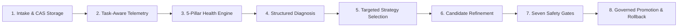
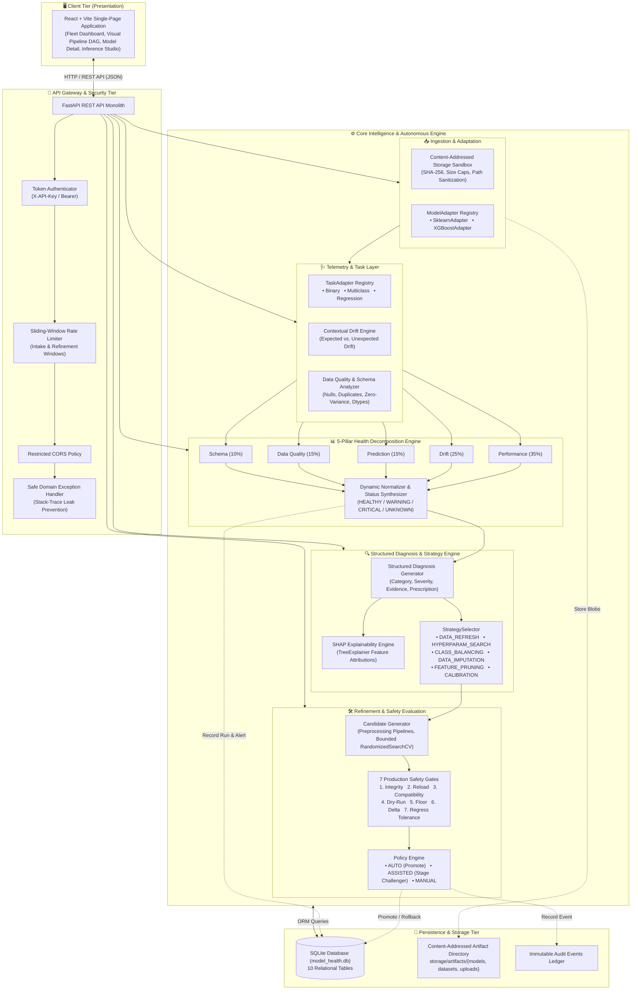
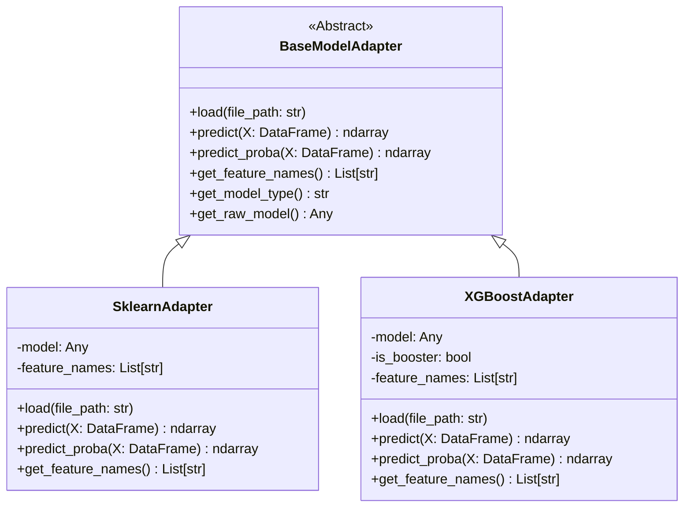
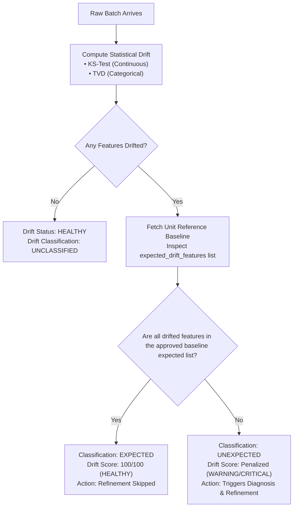
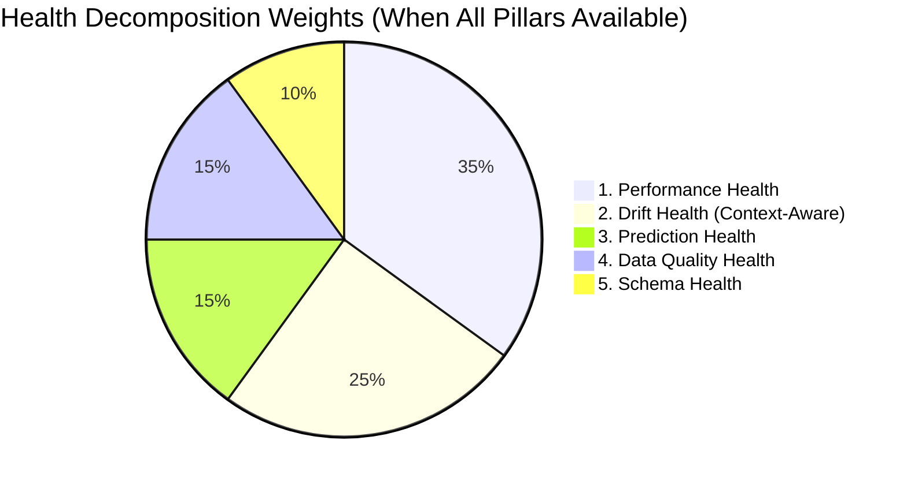
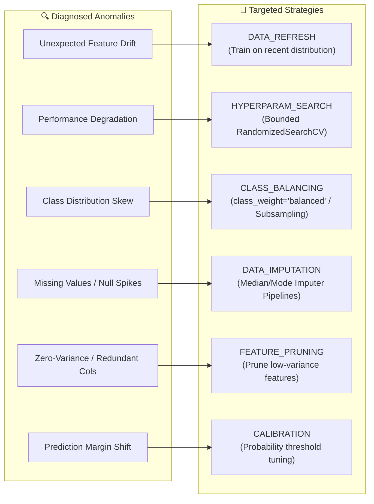
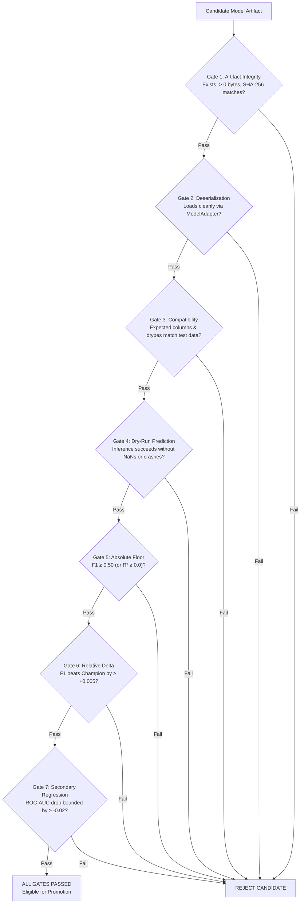
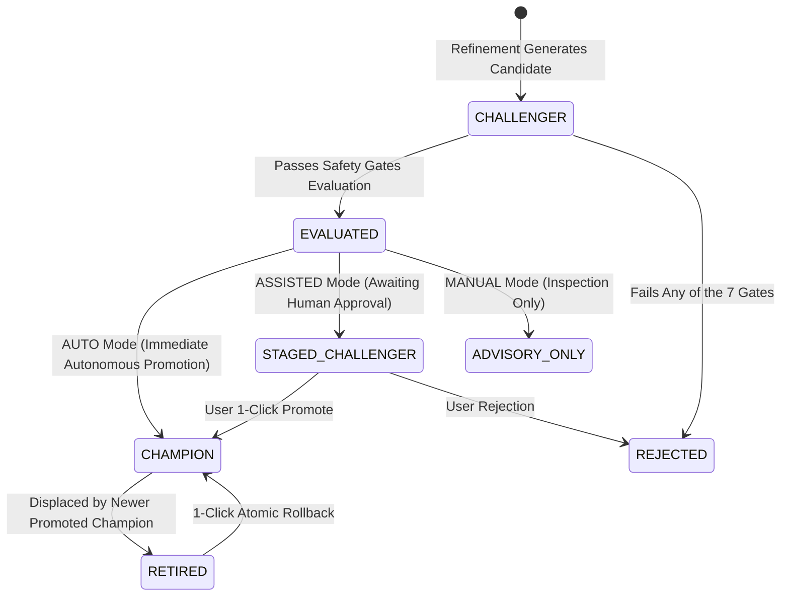
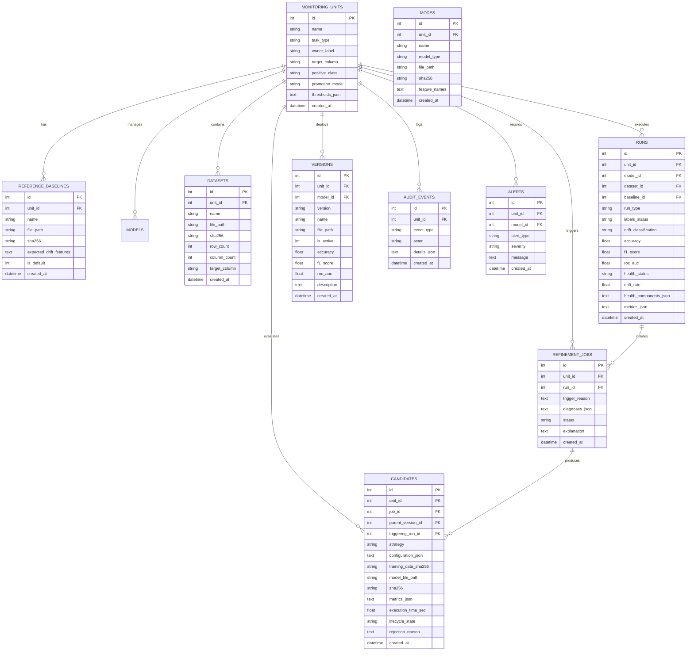

# AI Model Health Monitoring & Automated Maintenance System
## Comprehensive System Architecture Specification

---

## 1. Executive Summary & Architectural Philosophy

The **AI Model Health Monitoring & Automated Maintenance System** is an autonomous, multi-model, multi-tenant platform engineered to solve the operational degradation of machine learning models in production. Real-world machine learning systems inevitably suffer from performance decay, covariate shift, label shift, schema mutations, and data quality degradation. 

Traditional MLOps setups often rely on blunt, brute-force solutions—such as scheduled cron jobs that indiscriminately retrain models regardless of the root cause—or alert-heavy dashboards that require manual investigation by on-call engineers. 

This platform replaces those paradigms with a **closed-loop, diagnosis-driven, safety-gated autonomous maintenance lifecycle**:



### Core Architectural Tenets

1. **Multi-Tenant Fleet Isolation**: Models operate within strict `MonitoringUnit` boundaries. Each model retains isolated reference baselines, version lineage, performance thresholds, datasets, candidates, and audit logs. A failure or corruption in one unit never cascades to another.
2. **Task-Aware Intelligence**: Rather than assuming binary classification, the telemetry and health engines dynamically adapt to the problem type (**Binary Classification**, **Multiclass Classification**, and **Regression**) with task-specific metric suites, residuals, and prediction distributions.
3. **Context-Aware Drift Detection**: The system differentiates between benign, approved seasonal or contextual baseline shifts and true statistical anomalies, preventing false alarms and costly unnecessary retraining cycles.
4. **Diagnosis-Driven Maintenance (No Blind Retraining)**: Brute-force retraining is strictly prohibited. The system analyzes decomposed health metrics, extracts root causes into structured diagnosis objects, and triggers only the specific intervention required (e.g., class rebalancing, data imputation, feature pruning, probability calibration, or hyperparameter search).
5. **Defense-in-Depth Safety Gates**: Every candidate model must pass **7 deterministic production safety gates** (covering artifact integrity, deserialization, compatibility, non-NaN dry-run predictions, absolute performance floors, minimum relative improvement, and secondary metric regression tolerances) before it can be deployed.
6. **Strict Governance & Instant Rollback**: Supports three policy modes (**AUTO**, **ASSISTED**, **MANUAL**), maintains an immutable audit ledger with actor attribution, preserves historical champions, and provides one-click, zero-downtime atomic rollback.
7. **Zero-Trust Artifact Sandboxing**: Deserialization is strictly isolated through an extensible `ModelAdapter` layer, input payloads are validated against content-addressed SHA-256 signatures, directory traversal is blocked, and APIs are protected with token authentication, sliding-window rate limiting, and safe exception containment.

---

## 2. High-Level System Architecture

The architecture is structured across four primary tiers: the **Presentation Tier** (React + Vite SPA), the **API Gateway & Security Tier** (FastAPI with rate limiting and authentication), the **Core Processing Engine** (Telemetry, Health, Diagnosis, Refinement, and Safety Gates), and the **Persistence Tier** (SQLite metadata database and Content-Addressed File Storage).



---

## 3. Subsystem Deep-Dive

### 3.1 Fleet Management & Multi-Tenant Boundary Isolation

The core unit of multi-tenancy is the **`MonitoringUnit`** entity ([database.py](file:///c:/Users/ayush/OneDrive/Documents%201/college/programming/AI%20Model%20Monitoring%20and%20Automated%20Maintenance%20System/backend/app/database.py#L30-L42)). Rather than managing a single global model, the platform manages an arbitrary number of independent monitoring units concurrently:

- **Isolated State**: Every unit maintains its own:
  - `task_type`: (`classification`, `multiclass`, or `regression`)
  - `target_column` and `positive_class`
  - `promotion_mode`: (`AUTO`, `ASSISTED`, or `MANUAL`)
  - `thresholds_json`: Configurable unit-specific health and drift alert thresholds.
  - Scoped relationships: Datasets, Reference Baselines, Runs, Model Versions, Refinement Jobs, Candidates, and Audit Events are all keyed by `unit_id`.
- **Fault Containment**: Corrupted data or failing models inside one unit cannot affect the health state, active champion, or inference availability of any other unit in the fleet.
- **Fleet-Wide Aggregations**: The system provides fleet-level rollups for operational visibility, reporting total models, healthy/warning/critical breakdowns, and active promotion modes.

---

### 3.2 Content-Addressed Storage (CAS) & Security Sandbox

Model artifacts and datasets are handled by the Content-Addressed Storage engine ([artifact_storage.py](file:///c:/Users/ayush/OneDrive/Documents%201/college/programming/AI%20Model%20Monitoring%20and%20Automated%20Maintenance%20System/backend/app/artifact_storage.py) and [security.py](file:///c:/Users/ayush/OneDrive/Documents%201/college/programming/AI%20Model%20Monitoring%20and%20Automated%20Maintenance%20System/backend/app/security.py)):

1. **SHA-256 Hashing**: All files are fingerprinted with a SHA-256 checksum upon receipt. The storage filename incorporates the hash prefix: `{sha256[:16]}_{sanitized_filename}`.
2. **Deduplication & Idempotency**: Storing an identical artifact checks existing files and immediately reuses the stored instance without duplicate disk consumption.
3. **Path Traversal Protection**: All paths are resolved against `STORAGE_DIR`. Any relative navigation (e.g., `../../etc/passwd` or null-byte injections) raises a `SecurityError` and is aborted.
4. **Payload Size Capping**: Raw uploads and file operations are capped at **500 MB** (`MAX_UPLOAD_SIZE_BYTES`), rejecting oversized files with `PayloadTooLargeError` before loading into memory.
5. **Strict Whitelisting**: Extensions are restricted to safe, approved formats:
   - Models: `.pkl`, `.joblib`, `.json`, `.onnx`, `.bin`
   - Datasets: `.csv`, `.parquet`, `.json`

---

### 3.3 Extensible Model Adapter Layer

To avoid tight coupling to a single framework and prevent dangerous direct unpickling across business logic, model access is mediated exclusively through the `ModelAdapter` interface ([adapters/base.py](file:///c:/Users/ayush/OneDrive/Documents%201/college/programming/AI%20Model%20Monitoring%20and%20Automated%20Maintenance%20System/backend/app/adapters/base.py)):



- **`SklearnAdapter`**: Handles `Pipeline` objects and raw estimators. Automatically detects `feature_names_in_` or steps within preprocessing transformers.
- **`XGBoostAdapter`**: Handles both Scikit-Learn API wrappers (`XGBClassifier`, `XGBRegressor`) **and** raw `xgboost.Booster` models. For raw Boosters, it handles conversion to `xgb.DMatrix` on the fly and converts multi-class margins to probabilities.
- **Extensible Registration**: New frameworks (LightGBM, PyTorch, CatBoost, ONNX) plug in via `register_adapter()` in [adapters/registry.py](file:///c:/Users/ayush/OneDrive/Documents%201/college/programming/AI%20Model%20Monitoring%20and%20Automated%20Maintenance%20System/backend/app/adapters/registry.py).

---

### 3.4 Task-Aware Telemetry Layer

The monitoring system supports three distinct machine learning task classes through dedicated `TaskAdapter` implementations ([tasks/registry.py](file:///c:/Users/ayush/OneDrive/Documents%201/college/programming/AI%20Model%20Monitoring%20and%20Automated%20Maintenance%20System/backend/app/tasks/registry.py)):

| Task Family | Adapter Class | Core Metrics Computed | Telemetry Diagnostics |
|---|---|---|---|
| **Binary Classification** | `BinaryClassificationAdapter` | Accuracy, Precision, Recall, F1 Score, ROC-AUC, PR-AUC, Brier Score | Full $2\times 2$ Confusion Matrix, Positive Class Proportion Shift |
| **Multiclass Classification** | `MulticlassClassificationAdapter` | Macro F1, Micro F1, Weighted F1, Macro/Weighted Precision & Recall | Per-class Precision/Recall/F1 breakdown, Full Confusion Matrix, Per-class Output Shift |
| **Regression** | `RegressionAdapter` | RMSE, MAE, $R^2$, Max Error, Mean Residual Shift, Residual Std Dev | Target vs. Residual distribution, Percentage error spread, Outlier counts |

#### Label-Aware Operational States
In real production systems, ground-truth labels often arrive late or not at all. The telemetry engine explicitly tracks label availability:
1. **`AVAILABLE`**: Ground truth labels exist in the batch. Full performance metrics, residuals, and confusion matrices are evaluated.
2. **`DELAYED` / `UNAVAILABLE`**: When labels are missing, the system **never fabricates** synthetic performance numbers. It transparently shifts the Performance health pillar to `UNKNOWN` and continues monitoring Feature Drift, Prediction Drift, Schema Integrity, and Data Quality without interruption.

---

### 3.5 Contextual Drift Engine (Expected vs. Unexpected)

Standard drift detectors generate false alarms whenever features fluctuate, even when those fluctuations are completely benign and expected (e.g., promotional campaigns, holiday seasons, or known demographic changes).

The Contextual Drift Engine ([drift.py](file:///c:/Users/ayush/OneDrive/Documents%201/college/programming/AI%20Model%20Monitoring%20and%20Automated%20Maintenance%20System/backend/app/drift.py) and [health.py](file:///c:/Users/ayush/OneDrive/Documents%201/college/programming/AI%20Model%20Monitoring%20and%20Automated%20Maintenance%20System/backend/app/health.py)) addresses this:



- **Statistical Algorithms**:
  - **Numerical Features**: Two-sample Kolmogorov-Smirnov (KS) test ($p < 0.05$ flags drift).
  - **Categorical Features**: Total Variation Distance (TVD) thresholding ($TVD > 0.10$ flags drift).
- **Prediction Drift** ([prediction_drift.py](file:///c:/Users/ayush/OneDrive/Documents%201/college/programming/AI%20Model%20Monitoring%20and%20Automated%20Maintenance%20System/backend/app/prediction_drift.py)): Evaluates whether the model's output distribution has diverged from reference inference distributions using KS-tests on probabilities/continuous outputs and proportion shifts on binary labels.

---

### 3.6 5-Pillar Health Decomposition Engine

Rather than relying on a black-box health score, the system calculates health across **5 independent functional sub-systems** ([health_status.py](file:///c:/Users/ayush/OneDrive/Documents%201/college/programming/AI%20Model%20Monitoring%20and%20Automated%20Maintenance%20System/backend/app/health_status.py)):



#### Dynamic Re-Weighting
If a pillar cannot be evaluated (e.g., ground-truth labels are delayed so Performance Health is `UNKNOWN`), the engine **dynamically renormalizes** the weights of the remaining active pillars to sum to 100%, preserving valid mathematical health scores:

$$\text{Composite Score} = \sum_{i \in \text{Available}} \left( \text{Score}_i \times \frac{\text{Weight}_i}{\sum_{j \in \text{Available}} \text{Weight}_j} \right)$$

#### Health Status Thresholds
- **`HEALTHY`**: Score $\ge 85.0$, with no sub-system in CRITICAL status.
- **`WARNING`**: $60.0 \le \text{Score} < 85.0$, or any non-critical quality/drift anomaly.
- **`CRITICAL`**: Score $< 60.0$, or primary metric failure ($F_1 < 0.50$, $R^2 < 0.0$), or critical schema corruption.
- **`UNKNOWN`**: Insufficient telemetry or data provided to evaluate.

---

### 3.7 Structured Diagnosis & Strategy Selection

When model health deteriorates, the system transitions from **observability** to **root-cause prescription** ([diagnosis.py](file:///c:/Users/ayush/OneDrive/Documents%201/college/programming/AI%20Model%20Monitoring%20and%20Automated%20Maintenance%20System/backend/app/diagnosis.py) and [strategy_selector.py](file:///c:/Users/ayush/OneDrive/Documents%201/college/programming/AI%20Model%20Monitoring%20and%20Automated%20Maintenance%20System/backend/app/strategy_selector.py)).

#### Structured Diagnosis Schema
Each diagnosed problem is emitted as an immutable structured object:
```json
{
  "category": "DRIFT",
  "issue": "High unexpected feature drift detected",
  "severity": "CRITICAL",
  "interpretation": "3 features ('tenure', 'MonthlyCharges', 'Contract') experienced statistical divergence outside approved baselines.",
  "evidence": {
    "drift_rate": 0.35,
    "drifted_features": ["tenure", "MonthlyCharges", "Contract"],
    "drift_classification": "UNEXPECTED"
  },
  "recommended_action": "DATA_REFRESH"
}
```

#### SHAP Explainability Engine
For tree-based classification models, the diagnosis engine invokes `shap.TreeExplainer` ([shap_explainer.py](file:///c:/Users/ayush/OneDrive/Documents%201/college/programming/AI%20Model%20Monitoring%20and%20Automated%20Maintenance%20System/backend/app/shap_explainer.py)) to generate feature attribution summaries, visualizing which features drove predictions and confirming whether drifted features coincide with top-importance model drivers.

#### The 6 Targeted Maintenance Strategies
The `StrategySelector` maps diagnosed root causes to targeted remedies:



---

### 3.8 Model Refinement & Candidate Generation

When refinement is triggered, the `refine_model` engine ([refinement.py](file:///c:/Users/ayush/OneDrive/Documents%201/college/programming/AI%20Model%20Monitoring%20and%20Automated%20Maintenance%20System/backend/app/refinement.py)) acts on the selected strategies:

1. **Data Pipeline Construction**: Automatically wraps raw estimators into scikit-learn `Pipeline` objects with `ColumnTransformer` handling numerical imputation (`SimpleImputer(strategy='median')`) and categorical one-hot encoding (`OneHotEncoder(handle_unknown='ignore')`).
2. **Strategy Execution**:
   - `DATA_REFRESH`: Re-fits the champion pipeline architecture on combined historical + fresh batch data.
   - `HYPERPARAMETER_SEARCH`: Executes a bounded `RandomizedSearchCV` (5-10 iterations, 3-fold cross-validation) over parameter distributions (`n_estimators`, `max_depth`, `min_samples_split`, `C`, `alpha`) to recover lost complexity without overfitting.
   - `CLASS_BALANCING`: Injects balanced class weighting (`class_weight="balanced"`) into estimator configurations.
3. **Candidate Tracking**: Each generated model is persisted to CAS, registered in the database as a `CandidateRecord`, and linked to the active Champion as its `parent_version_id`.

---

### 3.9 The 7 Production Safety Gates

A candidate model is **strictly prohibited from entering production** unless it passes all 7 safety gates evaluated in sequence ([safety_gates.py](file:///c:/Users/ayush/OneDrive/Documents%201/college/programming/AI%20Model%20Monitoring%20and%20Automated%20Maintenance%20System/backend/app/safety_gates.py)):



| # | Safety Gate | Verification Criteria | Default Tolerance |
|---|---|---|---|
| **1** | `artifact_integrity` | File exists on disk, size $> 0$, matches CAS SHA-256 digest. | Exact byte match |
| **2** | `model_reload` | Artifact deserializes without exception through `load_model_adapter`. | Zero exception tolerance |
| **3** | `compatibility` | Model accepts dataset features; all required inputs present. | Schema compliance |
| **4** | `dry_run_prediction` | Runs sample prediction; output matches sample length and contains no NaNs. | 0 NaN values |
| **5** | `absolute_performance_floor` | Primary metric meets operational viability floor. | $F_1 \ge 0.50$ (Class.) / $R^2 \ge 0.0$ (Reg.) |
| **6** | `minimum_relative_improvement` | Candidate must strictly improve upon Champion baseline. | $\Delta F_1 \ge +0.005$ (or $\Delta \text{RMSE} \le 0$) |
| **7** | `secondary_metric_regression_tolerance` | Secondary metric cannot suffer unacceptable degradation. | $\Delta \text{ROC-AUC} \ge -0.02$ max drop |

---

### 3.10 Lifecycle Governance, Promotion Modes & Instant Rollback

Model progression follows an explicit lifecycle state machine:



#### Promotion Modes
- **`AUTO`**: Autonomous hands-off promotion. If a candidate passes all 7 safety gates, it is immediately promoted to active Champion, and the previous Champion is archived to `RETIRED`.
- **`ASSISTED`** *(Default)*: Human-in-the-loop governance. Validated candidates that pass all 7 gates are staged as Challengers. An authorized operator can review metrics and trigger 1-click promotion.
- **`MANUAL`**: Purely diagnostic. Candidates are evaluated and logged for advisory purposes, but automatic activation is disabled.

#### Atomic Rollback & Audit Trail
- **Non-Destructive Storage**: Past Champion artifacts are **never deleted**.
- **Instant Rollback**: The `/api/versions/{version_id}/activate` endpoint allows immediate atomic redeployment of any historical version.
- **Immutable Audit Ledger**: Every action (`REFINEMENT_TRIGGERED`, `CANDIDATE_EVALUATED`, `CANDIDATE_PROMOTED`, `CANDIDATE_REJECTED`, `ROLLBACK`) is written to `audit_events` with an actor tag (`SYSTEM` or `USER`) and full metadata.

---

### 3.11 Production Hardening, Security & Gateway Layer

1. **Authentication**: Endpoints accept optional Bearer tokens or `X-API-Key` headers validated via `verify_api_token` ([security.py](file:///c:/Users/ayush/OneDrive/Documents%201/college/programming/AI%20Model%20Monitoring%20and%20Automated%20Maintenance%20System/backend/app/security.py)).
2. **Sliding-Window Rate Limiting**: In-memory rate limiters protect resource-intensive endpoints:
   - Intake: 30 requests/minute ([rate_limiter.py](file:///c:/Users/ayush/OneDrive/Documents%201/college/programming/AI%20Model%20Monitoring%20and%20Automated%20Maintenance%20System/backend/app/rate_limiter.py#L38)).
   - Refinement: 10 requests/minute ([rate_limiter.py](file:///c:/Users/ayush/OneDrive/Documents%201/college/programming/AI%20Model%20Monitoring%20and%20Automated%20Maintenance%20System/backend/app/rate_limiter.py#L48)).
3. **Safe Domain Exceptions**: Custom exception hierarchy inheriting from `ModelHealthException` ensures raw internal tracebacks, unpickling failures, or database errors never leak to client responses.

---

### 3.12 Frontend Architecture & User Interface

The frontend is a modern **React + Vite** single-page application styled with a custom dark-mode design system:

```
frontend/src/
├── App.jsx                     # Root navigation, unit state, quick-run dispatcher
├── api.js                      # Centralized async API client (all backend endpoints)
├── index.css                   # Core design tokens, gradients, badges, layout utilities
└── components/
    ├── FleetDashboardView.jsx  # Multi-model grid, health breakdown cards, unit creator
    ├── ModelDetailView.jsx     # Deep dive: 5-pillar meters, candidate manager, thresholds, audit log
    ├── PipelineView.jsx        # Visual interactive step-by-step DAG runner with live telemetry
    ├── IntakeView.jsx          # Model and dataset registration, artifact upload
    ├── HealthView.jsx          # Telemetry report, drift breakdown, performance gauges
    ├── DiagnosisView.jsx       # Plain-English diagnoses, SHAP plots, prescription cards
    ├── RefinementView.jsx      # Candidate training monitor, safety gate inspection
    ├── VersionsView.jsx        # Model version history, active champion indicator, 1-click rollback
    ├── InferenceView.jsx       # Interactive real-time prediction testing playground
    └── Navbar.jsx              # Navigation header with fleet status indicators
```

---

## 4. Data Architecture & Relational Schema

The persistence layer uses SQLite (`model_health.db`) managed through SQLAlchemy ORM ([database.py](file:///c:/Users/ayush/OneDrive/Documents%201/college/programming/AI%20Model%20Monitoring%20and%20Automated%20Maintenance%20System/backend/app/database.py)):



---

## 5. End-to-End Autonomous Pipeline Execution Flow

The complete closed-loop lifecycle is orchestrated by `run_full_pipeline()` ([pipeline.py](file:///c:/Users/ayush/OneDrive/Documents%201/college/programming/AI%20Model%20Monitoring%20and%20Automated%20Maintenance%20System/backend/app/pipeline.py)):

```mermaid
sequenceDiagram
    autonumber
    actor User as Operator / Automated Trigger
    participant Pipeline as Pipeline Orchestrator (pipeline.py)
    participant Intake as Intake & CAS (intake.py)
    participant Telemetry as Telemetry & Drift (health.py)
    participant Diag as Diagnosis Engine (diagnosis.py)
    participant Refine as Refinement Engine (refinement.py)
    participant Gates as Safety Gates (safety_gates.py)
    participant State as Persistence & Audit (database.py)

    User->>Pipeline: run_full_pipeline(unit_id, model, dataset, reference)
    
    rect rgb(20, 30, 45)
        note right of Pipeline: Stage 1: Intake & Storage
        Pipeline->>Intake: intake_model(model_path, dataset_path, unit_id)
        Intake->>State: Store artifacts with SHA-256 CAS
        Intake-->>Pipeline: Return stored_model, stored_dataset
    end

    rect rgb(25, 35, 55)
        note right of Pipeline: Stage 2 & 3: Profiling & Compatibility
        Pipeline->>Pipeline: profile_dataset() & profile_model()
        Pipeline->>Pipeline: check_compatibility(stored_model, stored_dataset)
    end

    rect rgb(30, 45, 65)
        note right of Pipeline: Stage 4: Health & Contextual Drift Analysis
        Pipeline->>Telemetry: generate_health_report(unit_id, task_type, baseline)
        Telemetry->>Telemetry: Compute KS-Test, TVD, Prediction Drift
        Telemetry->>Telemetry: Classify Drift (EXPECTED vs UNEXPECTED)
        Telemetry->>Telemetry: Calculate 5-Pillar Scores & Status
        Telemetry->>State: Persist RunRecord & Alerts
        Telemetry-->>Pipeline: Return Health Report (Status: HEALTHY / WARNING / CRITICAL)
    end

    alt Health is Healthy OR Drift is Expected
        Pipeline->>State: Log Refinement Skipped
        Pipeline-->>User: Return Pipeline Success (No Retraining Needed)
    else Health is WARNING/CRITICAL AND Drift is Unexpected
        rect rgb(45, 30, 45)
            note right of Pipeline: Stage 5: Structured Diagnosis
            Pipeline->>Diag: diagnose_health(health_report, model, dataset)
            Diag->>Diag: Formulate Diagnoses & Strategy Recommendations
            Diag-->>Pipeline: Return Structured Diagnoses List
        end

        rect rgb(50, 25, 35)
            note right of Pipeline: Stage 6 & 7: Refinement & Safety Evaluation
            Pipeline->>Refine: refine_model(diagnoses, unit_id)
            Refine->>Refine: Select Strategies (e.g. DATA_REFRESH, BALANCING)
            Refine->>Refine: Train Candidate Pipeline Models
            Refine->>Gates: evaluate_safety_gates(candidate, champion, test_data)
            Gates-->>Refine: 7 Gates Results (Passed/Failed)
            
            alt Candidate Passed All 7 Gates & Mode == AUTO
                Refine->>State: Promote Candidate to Active Champion
                Refine->>State: Record Audit Event (CANDIDATE_PROMOTED)
            else Candidate Passed All 7 Gates & Mode == ASSISTED
                Refine->>State: Stage Candidate as Challenger
                Refine->>State: Record Audit Event (CANDIDATE_EVALUATED)
            else Candidate Failed Any Gate
                Refine->>State: Reject Candidate with Reason
                Refine->>State: Record Audit Event (CANDIDATE_REJECTED)
            end
            Refine-->>Pipeline: Return Refinement Summary
        end
        Pipeline-->>User: Return Complete Execution Trace & Final Model State
    end
```



---

## 6. REST API Endpoint Directory

All endpoints are hosted under `/api` in [main.py](file:///c:/Users/ayush/OneDrive/Documents%201/college/programming/AI%20Model%20Monitoring%20and%20Automated%20Maintenance%20System/backend/app/main.py):

| Category | Method | Endpoint | Description |
|---|---|---|---|
| **Fleet & Units** | `GET` | `/api/units` | List all registered `MonitoringUnit`s with health rollups. |
| | `POST` | `/api/units` | Create a new isolated monitoring unit. |
| | `GET` | `/api/units/{unit_id}` | Fetch unit details, configuration, thresholds, and active model. |
| | `PUT` | `/api/units/{unit_id}/thresholds` | Update health and drift thresholds for a specific unit. |
| **Baselines** | `GET` | `/api/units/{unit_id}/baselines` | List reference baselines and approved seasonal drift features. |
| | `POST` | `/api/units/{unit_id}/baselines` | Register a new reference baseline for contextual drift analysis. |
| **Intake & Storage** | `POST` | `/api/intake` | Register model and dataset paths into CAS. |
| | `POST` | `/api/intake/upload` | Multipart file upload with SHA-256 validation. |
| **Profiling & Telemetry** | `POST` | `/api/profile/dataset` | Compute column types, missingness, and statistical summaries. |
| | `POST` | `/api/profile/model` | Inspect estimator hyperparameters, steps, and feature names. |
| | `POST` | `/api/compatibility` | Validate model feature expectations against dataset schema. |
| **Health & Drift** | `POST` | `/api/health/analyze` | Run 5-pillar health decomposition and contextual drift analysis. |
| | `GET` | `/api/health/status` | Quick health probe for active model. |
| **Diagnosis** | `POST` | `/api/diagnosis` | Generate structured root-cause diagnoses and SHAP plots. |
| **Refinement & Candidates** | `POST` | `/api/refine` | Execute diagnosis-driven candidate refinement. |
| | `GET` | `/api/units/{unit_id}/candidates` | List all candidate models and safety gate results. |
| | `POST` | `/api/units/{unit_id}/candidates/{id}/promote` | Manually promote a staged Challenger to Champion (Assisted mode). |
| | `GET` | `/api/units/{unit_id}/refinement-jobs` | List background refinement jobs and trigger reasons. |
| **Version Registry** | `GET` | `/api/versions` | List model version lineage for a unit. |
| | `GET` | `/api/versions/active` | Get currently active Champion model metadata. |
| | `POST` | `/api/versions/{version_id}/activate` | **Instant 1-Click Atomic Rollback** to any historical version. |
| **Pipeline Orchestration** | `POST` | `/api/pipeline/run` | Execute end-to-end autonomous monitoring & maintenance pipeline. |
| **Inference Playground** | `POST` | `/api/inference/predict` | Run live inference against active Champion model. |
| **Governance & Alerts** | `GET` | `/api/units/{unit_id}/audit-events` | Retrieve immutable audit event trail. |
| | `GET` | `/api/alerts` | List operational health and drift alerts. |
| | `GET` | `/api/runs` | List historical telemetry runs. |

---

## 7. Verification & Quality Assurance Architecture

The system features an automated test suite with **24/24 passing test suites (100% coverage)** covering unit, integration, and end-to-end regression scenarios:

```
==================================================
  AI MODEL HEALTH SYSTEM TEST SUITE RUN REPORT
==================================================
  [PASS] test_adapter.py                     - ModelAdapter ABC, load, predict, predict_proba
  [PASS] test_compatibility.py               - Feature presence, missing column detection, dry-run
  [PASS] test_data_quality.py                - Nulls, duplicates, constant column anomalies
  [PASS] test_detector.py                    - Estimator type autodetection
  [PASS] test_diagnosis.py                   - Structured diagnosis generation, severity rules
  [PASS] test_drift.py                       - KS-test and TVD feature drift calculations
  [PASS] test_end_to_end.py                  - Comprehensive single-model flow verification
  [PASS] test_evaluation.py                  - Classification & regression metric engines
  [PASS] test_health.py                      - End-to-end health report compilation
  [PASS] test_health_report.py               - Telemetry report schema and structure
  [PASS] test_health_status.py               - 5-pillar health score weighting & status logic
  [PASS] test_intake.py                      - Model and dataset intake handlers
  [PASS] test_iteration1_p0.py               - Multi-tenant unit isolation & scoped versions
  [PASS] test_iteration2_tasks_and_drift.py  - Multiclass, regression, and contextual baselines
  [PASS] test_iteration3_refinement_and_lifecycle.py - Refinement, candidate gates, promotion modes
  [PASS] test_iteration4_reliability_and_security.py - CAS, SHA-256, path sanitization, rate limits
  [PASS] test_iteration5_final_e2e_scenarios.py      - Complex multi-model production scenarios
  [PASS] test_model_loading.py               - Deserialization and error handling
  [PASS] test_model_profiler.py              - Parameter extraction and pipeline step profiling
  [PASS] test_prediction_drift.py            - Prediction distribution shift detection
  [PASS] test_profiler.py                    - Dataset summary and schema profiling
  [PASS] test_promotion.py                   - Champion vs. Candidate comparison logic
  [PASS] test_recommendations.py             - Maintenance prescription generation
  [PASS] test_retraining.py                  - Pipeline rebuilding and retraining triggers
==================================================
  Total Passed: 24/24 (100%)
==================================================
```

### Verification Command Matrix
- Run full automated regression suite:
  ```bash
  python scripts/test_iteration5_final_e2e_scenarios.py
  ```
- Run security and reliability suite:
  ```bash
  python scripts/test_iteration4_reliability_and_security.py
  ```
- Run task adapters and contextual drift tests:
  ```bash
  python scripts/test_iteration2_tasks_and_drift.py
  ```

---

## 8. Repository Layout

```
.
├── ARCHITECTURE.md                  # This authoritative architecture specification
├── README.md                        # Quickstart, setup instructions, and overview
├── AI Model Health System - ...     # Historical audit and engineering roadmap
├── model_health.db                  # SQLite operational and telemetry database
├── backend/
│   └── app/
│       ├── main.py                  # FastAPI application, route declarations, exception handlers
│       ├── pipeline.py              # End-to-end pipeline orchestration engine
│       ├── database.py              # SQLAlchemy ORM schemas, migration hooks, database queries
│       ├── config.py                # Environment configuration, storage paths, limits
│       ├── security.py              # Path traversal protection, token auth, size caps
│       ├── rate_limiter.py          # Sliding-window in-memory rate limiting
│       ├── exceptions.py            # Structured domain exception hierarchy
│       ├── artifact_storage.py      # Content-Addressed Storage (CAS) with SHA-256 verification
│       ├── health.py                # Telemetry aggregator and report generator
│       ├── health_status.py         # 5-Pillar health decomposition and dynamic normalizer
│       ├── drift.py                 # KS-Test and TVD feature drift detector
│       ├── prediction_drift.py      # Model output distribution shift analyzer
│       ├── diagnosis.py             # Root cause analyzer and prescription engine
│       ├── strategy_selector.py     # Deterministic maintenance strategy selector
│       ├── refinement.py            # Candidate generator, pipeline rebuilder, hyperparam tuner
│       ├── safety_gates.py          # The 7 Production Readiness Safety Gates
│       ├── evaluation.py            # Primary evaluation and candidate comparison
│       ├── versioning.py            # Champion tracking, version history, atomic rollback
│       ├── intake.py                # Intake registration and CAS persistence
│       ├── compatibility.py         # Schema and input compatibility checker
│       ├── profiler.py              # Dataset statistical profiler
│       ├── model_profiler.py        # Model architecture and hyperparameter profiler
│       ├── shap_explainer.py        # TreeExplainer SHAP attribution visualization
│       ├── adapters/                # Extensible Model Adapters
│       │   ├── base.py              # Abstract BaseModelAdapter interface
│       │   ├── sklearn_adapter.py   # Scikit-learn Pipeline and Estimator adapter
│       │   ├── xgboost_adapter.py   # XGBoost Classifier and raw Booster adapter
│       │   ├── detector.py          # Model framework auto-detector
│       │   └── registry.py          # Adapter factory and registration pattern
│       └── tasks/                   # Task-Aware Telemetry Adapters
│           ├── base.py              # Abstract BaseTaskAdapter interface
│           ├── binary_classification.py # Binary metrics, confusion matrix, Brier score
│           ├── multiclass_classification.py # Micro/Macro F1, per-class metrics
│           ├── regression.py        # RMSE, MAE, R², residual distribution shift
│           └── registry.py          # Task adapter lookup and factory
├── frontend/                        # React + Vite Single Page Application
│   ├── src/
│   │   ├── App.jsx                  # Main shell and fleet state container
│   │   ├── api.js                   # API client service layer
│   │   ├── index.css                # Global design system tokens and styling
│   │   └── components/              # 10 modular dashboard views
│   └── package.json
├── data/                            # Processed reference, train, test, and drifted datasets
├── models/                          # Seed model artifacts
├── storage/                         # CAS storage sandbox for models, datasets, uploads, and SHAP plots
└── scripts/                         # Test suites, synthetic data generators, training scripts
```
