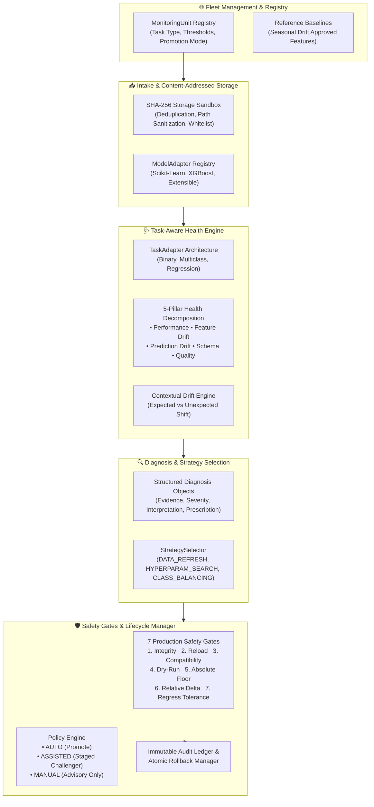

# AI Model Health Monitoring & Automated Maintenance System

An autonomous, multi-model, multi-tenant AI model reliability and lifecycle management platform.

> 📖 **Architecture Specification**: For the comprehensive technical deep dive, data schemas, sequence diagrams, and subsystem designs, see [ARCHITECTURE.md](ARCHITECTURE.md).

---

## 🏛️ System Architecture



---

## 🚀 Key Platform Capabilities

### 1. Multi-Model Fleet Isolation
- **MonitoringUnit Boundary**: Every registered model operates with completely isolated baselines, dataset registry, version lineage, performance thresholds, and runtime state.
- **Fault Containment**: Failure or corruption in one unit leaves all other fleet models pristine and unaffected.

### 2. Task-Aware Monitoring Layer
- Direct support for:
  - **Binary Classification**: Accuracy, Precision, Recall, F1, ROC-AUC, PR-AUC, Confusion Matrix, Brier Score.
  - **Multiclass Classification**: Macro/Micro/Weighted F1, Per-Class Precision/Recall, Per-Class Prediction Drift.
  - **Regression**: RMSE, MAE, R², Mean Residual Shift, Prediction Distribution Shift.
- **Labels-Aware Telemetry**: Delayed or unobserved labels are reported as `DELAYED` or `UNAVAILABLE` without fabricated metrics.

### 3. Contextual Drift Engine (Expected vs Unexpected)
- Distinguishes benign, expected domain shifts (e.g. approved seasonal baselines) from true statistical anomalies, avoiding disruptive and costly retraining.

### 4. Diagnosis-Driven Maintenance
- Replaces brute-force retraining with targeted interventions:
  - Unexpected Drift $\rightarrow$ `DATA_REFRESH`
  - Performance Decay $\rightarrow$ Bounded `RandomizedSearchCV`
  - Class Imbalance $\rightarrow$ `CLASS_BALANCING`
  - Missing Values $\rightarrow$ `DATA_IMPUTATION`
  - Zero/Low-Variance Columns $\rightarrow$ `FEATURE_PRUNING`
  - Output Shift $\rightarrow$ `CALIBRATION`

### 5. Production Safety Gates
Candidate models are only deployed if they pass all 7 safety gates:
1. `artifact_integrity`: Checksum verification.
2. `model_reload`: Deserialization test.
3. `compatibility`: Input schema verification.
4. `dry_run_prediction`: Non-NaN sample prediction.
5. `absolute_performance_floor`: Operational minimum metric threshold.
6. `minimum_relative_improvement`: Must beat Champion by $\ge +0.005$.
7. `secondary_metric_regression_tolerance`: Regressions bounded by $\ge -0.02$.

### 6. Safe Lifecycle & Instant Rollback
- Historical Champions are never deleted.
- 1-click atomic rollback to any prior active version with audit trail logging.

---

## 🎬 End-to-End Demo & Verification Flow

### 1. Start the Backend API
```bash
uvicorn backend.app.main:app --host 0.0.0.0 --port 8000 --reload
```

### 2. Start the Fleet Dashboard Frontend
```bash
cd frontend
npm run dev
```

### 3. Run Full System Test Suite
```bash
python scripts/test_iteration5_final_e2e_scenarios.py
```

---

## 🧪 Complete Test Suite Status (24/24 Passed)

```
  [PASS] test_adapter.py
  [PASS] test_compatibility.py
  [PASS] test_data_quality.py
  [PASS] test_detector.py
  [PASS] test_diagnosis.py
  [PASS] test_drift.py
  [PASS] test_end_to_end.py
  [PASS] test_evaluation.py
  [PASS] test_health.py
  [PASS] test_health_report.py
  [PASS] test_health_status.py
  [PASS] test_intake.py
  [PASS] test_iteration1_p0.py
  [PASS] test_iteration2_tasks_and_drift.py
  [PASS] test_iteration3_refinement_and_lifecycle.py
  [PASS] test_iteration4_reliability_and_security.py
  [PASS] test_iteration5_final_e2e_scenarios.py
  [PASS] test_model_loading.py
  [PASS] test_model_profiler.py
  [PASS] test_prediction_drift.py
  [PASS] test_profiler.py
  [PASS] test_promotion.py
  [PASS] test_recommendations.py
  [PASS] test_retraining.py
==================================================
Total Passed: 24/24 (100%)
```
